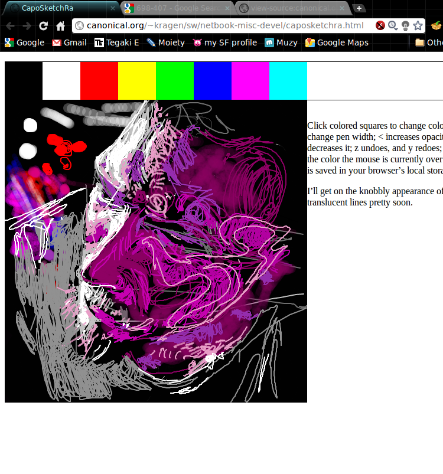

My cousin SMWS was frustrated that <http://sketchfu.com/> was going
unmaintained and that Muzy was slow and required Flash, so I thought
I’d write a quick HTML5 clone.  I wrote most of the code, but he did a
lot of the interaction design and some of the internal software
architecture.

At this point, it’s barely possible to ues it to create worthwhile
drawings.  Try <http://kragen.github.com/aikidraw/aikidraw.html>.

